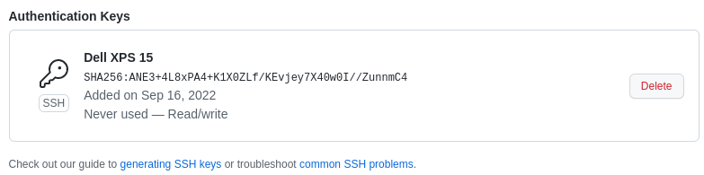
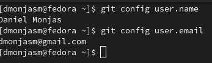

# Configuración git
En mi ordenador cree un par de claves público privadas y subí a github la pública, de forma que cada vez que subo los cambios no es necesario que introduzca mis credenciales

Por otro lado tengo establecidos el nombre y correo

